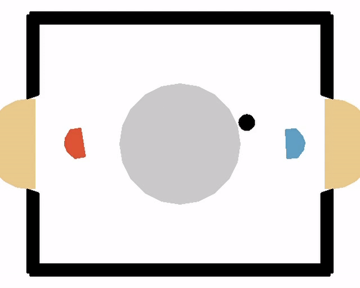

# Reinforcement-Learning-PPO (PyTorch)
Implementation of the PPO Algorithm  to control an agent in the hockey environment.
The project was done as part of the Reinforcement Learning course at the University of Tübingen in WS 20/21.

## Hockey environment
The hockey environment is a game between two players (player1 and player2). We can control the left player (player1)
The task is to maximize the cumulative reward (=sum of  rewards over all timesteps).
Over one game (episode) the cumulative reward mainly depends on which agents wins.
To win a game one agent needs to score a goal. After 230 timesteps without scoring the game is automatically draw.
If an agent wins he receives a reward of 10 in the final timestep (-10 for losing, 0 for draw).
During each timestep the agent agent gets aditional reward if he is close to the ball.
The environment has 18 observation dimensions and 4 action dimensions per agent.
Each action dimension takes a real value between [0,1].
Because the action of the opponent is unknown, it is a partially observable setting.

## Using PPO algorithm
To solve this environment we implmented the PPO (Proximal Polcy Optimization) algorithm.
Because PPO is a policy gradient algorithm, the agent's policy is modeled explicitly:
* GAE is used as an advantage estimator
* We choose a separate network for policy and value. However we apply gradient descent using a joint loss function
* To transform the actions into a continuous domain a Multivariate Normal Distribution is used
* To ensure that the actions are within [-1,1] we use Tanh for transformation
* Gradient clipping, input normalization, reward normalization are also implemented. For normalization the Welford online algorithm is used.
* For the implementation of the neural networks PyTorch is used
* The implementation does not use multitasking
* The whole process of training is split up into alternating periods of training and evaluation. Evaluation is always against the basic opponent and doesn't use exploration. If the agent achieves a record high evaluation performance his current checkpoint is added to a list of possible opponents. During training the next opponent (player2) is then sampled from the list of old checkpoints and the basic opponent provided by the laser hockey package. This prevents from overfitting the basic agent.

## Requirements
* enum
* pickle
* numpy
* torch
* gym
* box2d

## Results
* The implementation leads to a win rate of up to 91% when playing against both opponents in an alternating way. For other hyperparameters the performance might be better. 
* Because it is an on-policy algorithm, it is not surprising that beyond a certain point, performance seems to plateau
* The agent is on the left side:  
 

## Basic overview over implementation
* PPO: Implementation of the PPO algorithm
* Agent: Combines training, evaluation, statistics, saving, loading and adding to checkpoint list in one class.
* train: Helper method for training
* AgentRegister: Allows sampling opponents. Supports the training method
* test_agent: Helper method to see training results
* test_implementation: See an example how to train, see training results including plotting. Good starting point to explore the code.

## Helpful links wrt. to the project and especially to understand PPO:
* [Easy explanation of PPO](https://www.youtube.com/watch?v=5P7I-xPq8u8)
* [PPO paper](https://arxiv.org/abs/1707.06347)
* [RL adventure implementation](https://github.com/higgsfield/RL-Adventure-2) (Code also partially used)
* [PyTorch PPO implementation](https://github.com/nikhilbarhate99/PPO-PyTorch) (Code also partially used)
* [Hockey environment from university of Tübingen](https://github.com/martius-lab/laser-hockey-env)
